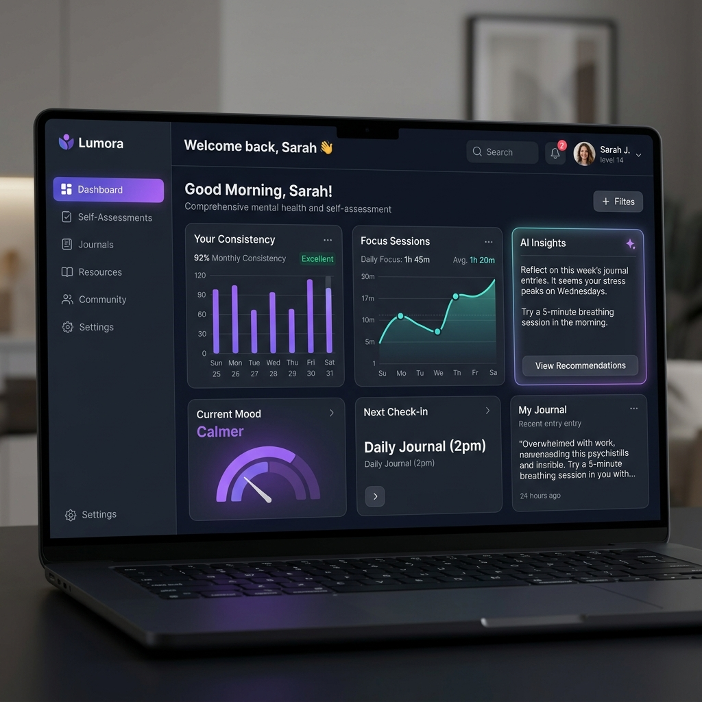

# 🌟 Lumora — Personal Growth & Mental Wellness Platform

<p align="center">
  
</p>

## 🚀 Overview

**Lumora** is a cutting-edge mental wellness platform designed to help users track their personal growth through data-driven insights and AI-powered assessments. Built with the **VILT stack** (Vue, Inertia, Laravel, Tailwind), Lumora provides a seamless, reactive experience for users to monitor their mental health journey.

## ✨ Key Features 

- **🧠 Self-Assessment Flow**: A guided onboarding process that helps users understand their current mental state.
- **📊 Interactive Dashboard**: Real-time tracking of consistency, focus sessions, and wellness metrics.
- **🤖 AI-Powered Insights**: Personalized feedback generated by Google Gemini AI based on user assessment results.
- **⚡ Reactive UI**: Lightning-fast transitions and data updates powered by Inertia.js.
- **🔒 Secure & Private**: Built on Laravel's robust security architecture.

## 🛠️ Tech Stack

- **Backend**: Laravel 12.x (PHP 8.2+)
- **Frontend**: Vue.js 3, Inertia.js, Tailwind CSS
- **Database**: PostgreSQL / MySQL / SQLite
- **AI Engine**: Google Gemini 1.5 Flash
- **API Integration**: Custom Go-based microservices for metric processing

## 📦 Installation

To get started with Lumora locally:

1. **Clone the repository**:
   ```bash
   git clone https://github.com/Syahril2401/Lumora.git
   cd Lumora
   ```

2. **Install dependencies**:
   ```bash
   composer install
   npm install
   ```

3. **Configure Environment**:
   ```bash
   cp .env.example .env
   php artisan key:generate
   ```

4. **Run Migrations & Seeders**:
   ```bash
   php artisan migrate --seed
   ```

5. **Start Development Server**:
   ```bash
   npm run dev
   ```

---

<p align="center">
  Made with ❤️ by the Lumora Team
</p>